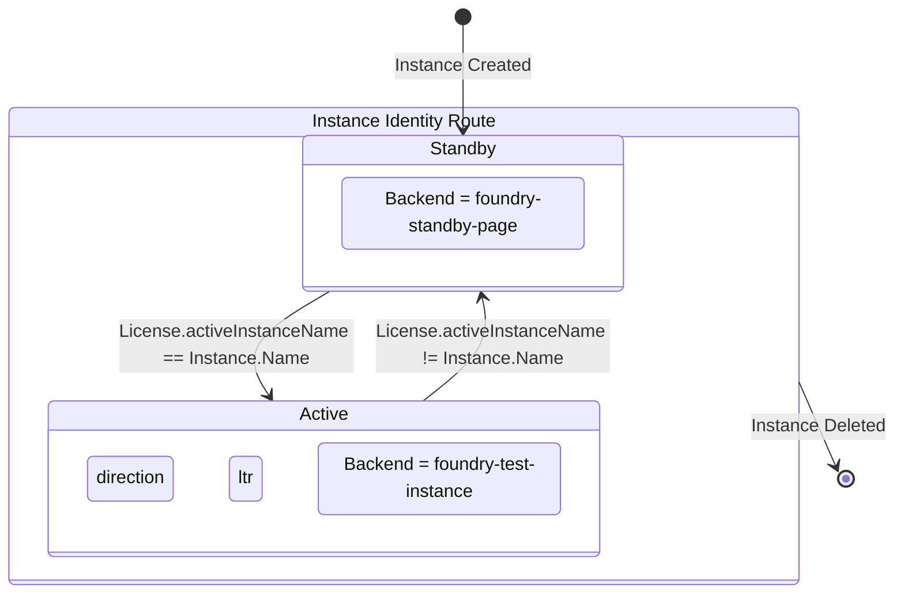
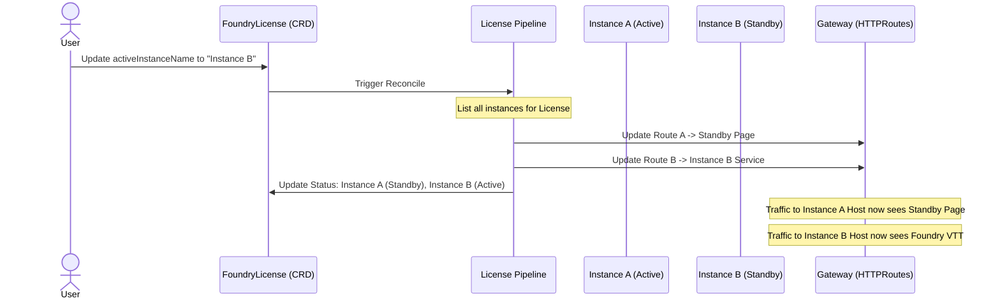

# Master License Routing Architecture

This document describes the design and implementation of the Master License Routing Control model for Foundry VTT instances in Kratix.

## Overview

The architecture centralizes all routing lifecycle management into the `FoundryLicense` Promise. This allows for atomic activation and deactivation of instances, ensuring that only one instance (or none) is "Active" for a given license at any time, while all instances remain reachable via a fallback standby page.

## Component Roles

### FoundryLicense (The Master)
- **Authority**: Dictates which instance is `Active`.
- **Manifest Generation**: Generates `HTTPRoute` and `DNSEndpoint` for **all** associated instances.
- **Routing Logic**: 
  - If `instance.name == license.activeInstanceName` → Route to `foundry-<name>` service.
  - Otherwise → Route to `foundry-standby-page` service.
- **Status Surfacing**: Maintains a registry of all instances and their current state.

### FoundryInstance (The Worker)
- **Lifecycle**: Manages the deployment of the Foundry application and its NFS storage.
- **Activation Trigger**: "Touches" the parent license during its own configuration to ensure routing manifests are updated immediately when the instance is created.

---

## State Machine: Instance Activation

The following diagram illustrates the state transition of a `FoundryInstance` identity route as controlled by the `FoundryLicense`.



---

## Sequence Diagram: Manual Switchover

This diagram shows the message flow when a user updates the `FoundryLicense` to switch the active instance.



---

## Technical Implementation Details

### License "Touch" Mechanism
To ensure zero-wait routing when a new instance is created, the `FoundryInstance` pipeline performs a `kubectl patch` on its parent `FoundryLicense`:

```bash
kubectl patch foundrylicense "$LICENSE_NAME" \
  --type=merge \
  -p "{\"metadata\":{\"annotations\":{\"foundry.platform/reconcile\":\"$(date +%s)\"}}}"
```

This forces Kratix to immediately execute the License's `validate-license` pipeline, which then detects the new instance and generates its identity route.

### Master Routing Logic
The license uses a `kubectl list` with a `jq` filter to find its subordinates:

```bash
INSTANCES=$(kubectl get foundryinstance -n $NS -o json | jq -c --arg L $LICENSE '.items[] | select(.spec.licenseRef.name == $L)')
```

For each match, it produces an `HTTPRoute` manifest with a conditional `backendRef`.
