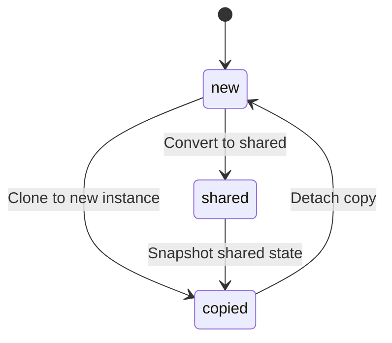

# Planned Features

This document outlines future enhancements for the Kratix Foundry platform.

---

## Volume Management Modes

Enhanced volume handling for worlds and plugins with three modes:

| Mode | Description |
|------|-------------|
| **`copied`** | Clone an existing instance's data to a new volume/NFS directory |
| **`shared`** | Use a shared volume across instances (useful for shared plugin libraries or world templates) |
| **`new`** | Create a fresh volume/NFS directory (current default behavior) |

### State Transitions

Volume modes will support controlled state transitions:



> [!NOTE]
> State transitions will be validated to prevent data loss (e.g., blocking `shared → new` if other instances depend on the volume).

---

## Foundry API Integration

### Player Session Monitoring

- Query Foundry's `/api/status` endpoint to detect logged-in players
- Inform instance switchover decisions:
  - Warn/block if players are connected to the active instance
  - Optional grace period before forced switchover
- Surface player count in `FoundryInstance.status`

```yaml
status:
  isActive: true
  connectedPlayers: 3
  lastPlayerActivity: "2025-12-22T16:30:00Z"
```

---

## Status Page Enhancements

### Activation Request Button

- Standby page includes "Request Activation" button
- Creates a K8s resource or webhook to request instance activation
- Optional approval workflow (manual or automated based on policy)

---

## Discord Integration

> [!TIP]
> Maintained as a **separate project** for cleaner separation of concerns.

### Bot Commands

| Command | Description |
|---------|-------------|
| `/vtt-status [<instance>]` | Show instance status (active/standby, players, version) |
| `/vtt-create <name> [options]` | Create a new FoundryInstance |
| `/vtt-delete <name>` | Mark instance for deletion (default: X days grace period) |
| `/vtt-update <name> [subcommands]` | Update instance configuration |

### Ownership & RBAC

- **License Ownership**: Discord users can own licenses
- **Instance Ownership**: Instances owned by users via license association
- **Discord RBAC**: 
  - Grant others permission to use licenses
  - Allow others to activate/manage instances
  - Role-based access (e.g., "Foundry Admin" role)

### License Controls

Licenses can define optional controls over attached instances:

```yaml
apiVersion: foundry.platform/v1alpha1
kind: FoundryLicense
metadata:
  name: dungeons-guild
spec:
  activeInstanceName: campaign-alpha
  # --- New Optional Controls ---
  defaults:
    foundryVersion: "13.347.0"
    proxySSL: true
  restrictions:
    maxInstances: 3
    allowedVersions: ["13.x"]
  sharedNfsRoot: /volume1/foundry/shared/dungeons-guild
  baseDomain: dungeons.example.com  # instances inherit: <instance>.dungeons.example.com
  ownership:
    discordUserId: "123456789"
    allowedActivators:
      - discordRoleId: "987654321"  # "Game Masters" role
```

---

## Foundry Version Selection

Allow users to specify their desired Foundry VTT version:

```yaml
apiVersion: foundry.platform/v1alpha1
kind: FoundryInstance
metadata:
  name: my-campaign
spec:
  foundryVersion: "13.348.0"  # Explicit version
  # OR
  foundryVersion: "latest"    # Track latest stable
  # OR
  foundryVersion: "13.x"      # Track latest in major version
```

### Version Management Features

- Version validation against available releases
- Upgrade/downgrade path validation (prevent breaking changes)
- Optional auto-update policy per instance or license

---

## Implementation Priority

| Priority | Feature | Complexity |
|----------|---------|------------|
| 🟢 High | Foundry version selection | Low |
| 🟢 High | Volume modes (basic) | Medium |
| 🟡 Medium | Player session monitoring | Medium |
| 🟡 Medium | Status page activation button | Low |
| 🟡 Medium | Discord bot (basic commands) | Medium |
| 🔴 Low | Volume state transitions | High |
| 🔴 Low | Discord RBAC & ownership | High |
| 🔴 Low | License controls & inheritance | High |

---

## Technical Considerations

### Bash vs Python SDK

Given the complexity of these planned features, **Python + Kratix SDK is strongly recommended**:

| Feature | Bash Challenge | Python Advantage |
|---------|---------------|------------------|
| Volume state machine | Complex conditional logic | Clean state pattern implementation |
| Foundry API calls | `curl` + `jq` chaining | `requests` + native JSON handling |
| Discord integration | Not practical | Discord.py or similar libraries |
| RBAC logic | Very difficult | Natural Python data structures |
| Unit testing | Nearly impossible | pytest for pipeline logic |

> [!IMPORTANT]
> The Discord bot will be a separate Python service regardless. Having pipelines in Python enables shared libraries for Foundry API interactions, validation logic, and data models.
